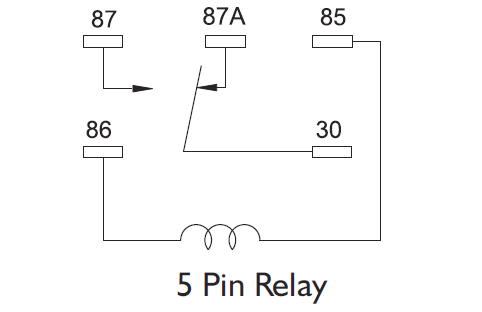
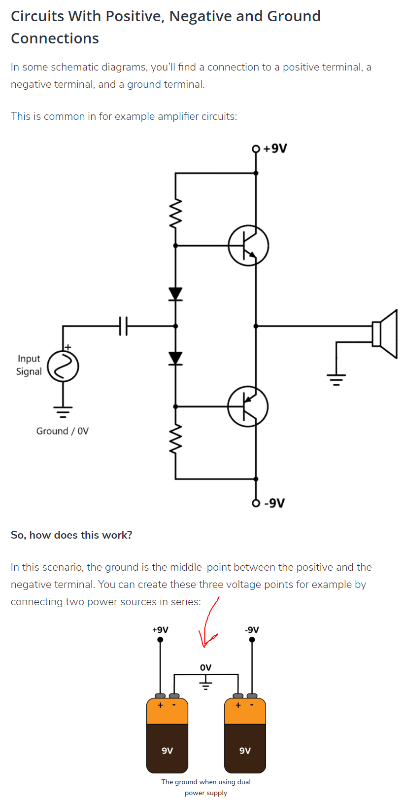

## hub-ctrl

Control USB power on a port by port basis on some USB hubs.

This only works on USB hubs that have the hardware necessary to allow software controlled power switching. Most hubs DO NOT include the hardware.

https://github.com/codazoda/hub-ctrl.c#controlling-power

    echo "sudo ./hub-ctrl -h 0 -P 1 -p 0" >> /dev/ttyUSB0

Found this in `resetPi0HID.sh`. This means hub 0, port 1, turn power off. `p 1` would turn it back on.

## v4l2-ctl

An application to control video4linux drivers

### Pi Zero vs Pi 4

From https://gist.github.com/gbaman/50b6cca61dd1c3f88f41. 

The Pi4 has a USB hub whereas in the Pi0 the USB port is connected directly to the proc.

## checkPi0Login.sh

This seems to be responsible for logging into the pi 0 and can also run a command on it.

## RPi.GPIO

This let's you use Python to control the GPIO on a Raspberry Pi.

### Pin Numbering

There are two ways of numbering the IO pins on a Raspberry Pi within RPi.GPIO. The first is using the BOARD numbering system. This refers to the pin numbers on the P1 header of the Raspberry Pi board. The advantage of using this numbering system is that your hardware will always work, regardless of the board revision of the RPi. You will not need to rewire your connector or change your code.

The second numbering system is the BCM numbers. This is a lower level way of working - it refers to the channel numbers on the Broadcom SOC. You have to always work with a diagram of which channel number goes to which pin on the RPi board. Your script could break between revisions of Raspberry Pi boards.

To specify which you are using using (mandatory):

    GPIO.setmode(GPIO.BOARD)
    # or
    GPIO.setmode(GPIO.BCM)

### Setup a Channel

You need to set up every channel you are using as an input or an output. To configure a channel as an input:

    GPIO.setup(channel, GPIO.IN)

(where channel is the channel number based on the numbering system you have specified (BOARD or BCM)).

More advanced information about setting up input channels can be found here.

To set up a channel as an output:

    GPIO.setup(channel, GPIO.OUT)

(where channel is the channel number based on the numbering system you have specified (BOARD or BCM)).

You can also specify an initial value for your output channel:

    GPIO.setup(channel, GPIO.OUT, initial=GPIO.HIGH)

### Output

To set the output state of a GPIO pin:

    GPIO.output(channel, state)

(where channel is the channel number based on the numbering system you have specified (BOARD or BCM)).

State can be 0 / GPIO.LOW / False or 1 / GPIO.HIGH / True.

## uart (universal asynchronous receiver/transmitter)

https://www.circuitbasics.com/basics-uart-communication/

UART stands for Universal Asynchronous Receiver/Transmitter. It’s not a communication protocol like SPI and I2C, but a physical circuit in a microcontroller, or a stand-alone IC. A UART’s main purpose is to transmit and receive serial data.

One of the best things about UART is that it only uses two wires to transmit data between devices. 

### How it Works

In UART communication, two UARTs communicate directly with each other. The transmitting UART converts parallel data from a controlling device like a CPU into serial form, transmits it in serial to the receiving UART, which then converts the serial data back into parallel data for the receiving device. Only two wires are needed to transmit data between two UARTs. Data flows from the Tx pin of the transmitting UART to the Rx pin of the receiving UART:

UARTs transmit data asynchronously, which means there is no clock signal to synchronize the output of bits from the transmitting UART to the sampling of bits by the receiving UART. Instead of a clock signal, the transmitting UART adds start and stop bits to the data packet being transferred. These bits define the beginning and end of the data packet so the receiving UART knows when to start reading the bits.

When the receiving UART detects a start bit, it starts to read the incoming bits at a specific frequency known as the baud rate. Baud rate is a measure of the speed of data transfer, expressed in bits per second (bps). Both UARTs must operate at about the same baud rate. The baud rate between the transmitting and receiving UARTs can only differ by about 10% before the timing of bits gets too far off.

## Parallel vs Serial visualized

## SPI

https://www.circuitbasics.com/basics-of-the-spi-communication-protocol

### General Overview

SPI is a common communication protocol used by many different devices. For example, SD card modules, RFID card reader modules, and 2.4 GHz wireless transmitter/receivers all use SPI to communicate with microcontrollers.

One unique benefit of SPI is the fact that data can be transferred without interruption. Any number of bits can be sent or received in a continuous stream. With I2C and UART, data is sent in packets, limited to a specific number of bits. Start and stop conditions define the beginning and end of each packet, so the data is interrupted during transmission.

### Master / Slave Relationship

Devices communicating via SPI are in a master-slave relationship. The master is the controlling device (usually a microcontroller), while the slave (usually a sensor, display, or memory chip) takes instruction from the master. The simplest configuration of SPI is a single master, single slave system, but one master can control more than one slave (more on this below).

**MOSI (Master Output/Slave Input)** - Line for the master to send data to the slave
**MISO (Master Input/Slave Output)** - Line for the slave to send data to the master
**SCLK (Clock)** - Line for the clock signal
**SS/CS (Slave Select/Chip Select)** - Line for the master to select which slave to send data to

### The Clock

The clock signal synchronizes the output of data bits from the master to the sampling of bits by the slave. One bit of data is transferred in each clock cycle, so the speed of data transfer is determined by the frequency of the clock signal. SPI communication is always initiated by the master since the master configures and generates the clock signal.

Any communication protocol where devices share a clock signal is known as synchronous. SPI is a synchronous communication protocol. There are also asynchronous methods that don’t use a clock signal. For example, in UART communication, both sides are set to a pre-configured baud rate that dictates the speed and timing of data transmission.

### Slave Select

The master can choose which slave it wants to talk to by setting the slave’s CS/SS line to a low voltage level. In the idle, non-transmitting state, the slave select line is kept at a high voltage level. Multiple CS/SS pins may be available on the master, which allows for multiple slaves to be wired in parallel. If only one CS/SS pin is present, multiple slaves can be wired to the master by daisy-chaining.

#### Multiple Slaves

SPI can be set up to operate with a single master and a single slave, and it can be set up with multiple slaves controlled by a single master. There are two ways to connect multiple slaves to the master. If the master has multiple slave select pins, the slaves can be wired in parallel like this:

If only one slave select pin is available, the slaves can be daisy-chained like this:

## avconv

https://libav.org/avconv.html

avconv is a very fast video and audio converter that can also grab from a live audio/video source. It can also convert between arbitrary sample rates and resize video on the fly with a high quality polyphase filter.

In `image.php`:

    system("avconv -f video4linux2 -i ". $_GET['vid'] ." -vframes 1 -s 720x480 -v quiet -y ". $filename);

    ‘-f fmt (input/output)’
    Force input or output file format. The format is normally autodetected for input files and guessed from file extension for output files, so this option is not needed in most cases.

    ‘-vframes number (output)’
        Set the number of video frames to record. This is an obsolete alias for -frames:v, which you should use instead.

    ‘-s[:stream_specifier] size (input/output,per-stream)’
        Set frame size.

        As an input option, this is a shortcut for the ‘video_size’ private option, recognized by some demuxers for which the frame size is either not stored in the file or is configurable – e.g. raw video or video grabbers.

        As an output option, this inserts the scale video filter to the end of the corresponding filtergraph. Please use the scale filter directly to insert it at the beginning or some other place.

        The format is ‘wxh’ (default - same as source). The following abbreviations are recognized:

    ‘-y (global)’
        Overwrite output files without asking.

    ‘-i filename (input)’
        input file name

## dtoverlay=dwc2

https://raspberrypi.stackexchange.com/questions/77059/what-does-dtoverlay-dwc2-really-do/77061

**Note:** OTG means On the Go

According to [this post](https://www.raspberrypi.org/forums/viewtopic.php?t=179259) it seems like these are drivers.

    dwc_otg is the driver that has been heavily patched to squeeze most performance & function in host mode on the Pi: the fiq stuff etc. So heavily patched that, despite the name, it only does host mode & not OTG.

    dwc2 is an upstream driver which can do the OTG host/gadget flip dictated by OTG_SENSE. In host mode performance will pale cf dwc_otg, hence it's only recommended for gadget mode.

### dtoverlay

See *Part 2: Device Tree overlays*

https://www.raspberrypi.org/documentation/configuration/device-tree.md

### USB Slave

https://www.techwalla.com/articles/what-is-a-usb-slave

USB connectors follow a master/slave relationship. That means that one device, usually a personal computer, acts as the master by controlling information in and out of a USB port. The USB peripheral, for example a small flash drive, acts as a slave. It can be operated only by the master or it won't work. In that respect, some USB slaves are useless unless connected to a master device.

The term "USB slaves" covers a whole range of peripheral devices. One of the more common forms of USB slave is the flash or thumb drive. These small units plug in to USB hubs on computers, offering chunks of external storage ranging from 256MB to 16GB and beyond. However, USB slaves also include devices such as webcams, printers or scanners. In each case, the device needs the master computer for full functionality, though some USB slaves such as cameras will work regardless. Some peripherals, such as smartphones, are not strictly slave devices, though they act as such when plugged into a computer.

## enableHID.sh

https://www.circuitbasics.com/raspberry-pi-zero-ethernet-gadget/

Based on the diagram and the fact that this is the Pi0 this seems to have something to do with forwarding the USB ports of the host in question.

**Update**: This seems to make the pi an actual USB device
### libcomposite

This library seems to give you control of making "gadgets"

## What is a relay?

https://en.wikipedia.org/wiki/Relay

A relay is an electrically operated switch. It consists of a set of input terminals for a single or multiple control signals, and a set of operating contact terminals. The switch may have any number of contacts in multiple contact forms, such as make contacts, break contacts, or combinations thereof.

Pin 87A and pin 30 are connected at rest. When you don't energize the relay, when it's a resting relay, if you look at my relay the three dots represent 30, 87, 87A. 87 is the energized connection and 87A is non energized. 30 is the input. Python program would be 86 - the signal wire (maybe 85). 

UPDATE: Purple is actually positive!
85/86 are signal pins. 85 is generally power (positive), 86 is generally negative input. In my diagram, we assume that the purple lines are a negative trigger. Nothing is happening on purple and when it executes it sends a negative signal down purple (probably). Generally better to signal negative; the reason is it limits the positive signal we're throwing so we don't short circuit something. 

The red wire would go to all relays on pin 85. The purple would go to pin 86 on all relays. When the program executes it sends a negative trigger which would then pull it to 87 from 87A.

The center dot is connected to 87A. If you wanted it connected at rest you would put it on that middle dot.

What does VCC mean?
- Something to do with the GPIO to relay
- Red wire is JDVCC and the purple wire is VCC

https://www.amazon.com/ask/questions/Tx3KQNCLLE7G8SC

The jumper is making the relay input the same as the signal input. The jumper is saying how do you want the signal to the relay to be controlled. Do you want to control it through JDVCC or through ground. It's defining what is purple input.
### What controls the amperage of the relay

It's controlled by the 
### Voltages

A volt relay requires a 5 volt negative and a 5 volt positive

Once you energize that relay there is nothing that says 30, 87, 87A have to be. You could connect a power connection of some other connection. You're only limited by the amount of current that can flow through the relay.

## What is a ground?

https://www.build-electronic-circuits.com/what-is-ground/

This is not a real series connection. By putting the ground in there you're making it so you're offering two different power sources but they aren't addititive.

USB connections are 5 volts (USB 2.0). That's how you're getting 5 volts 

5 volt 
